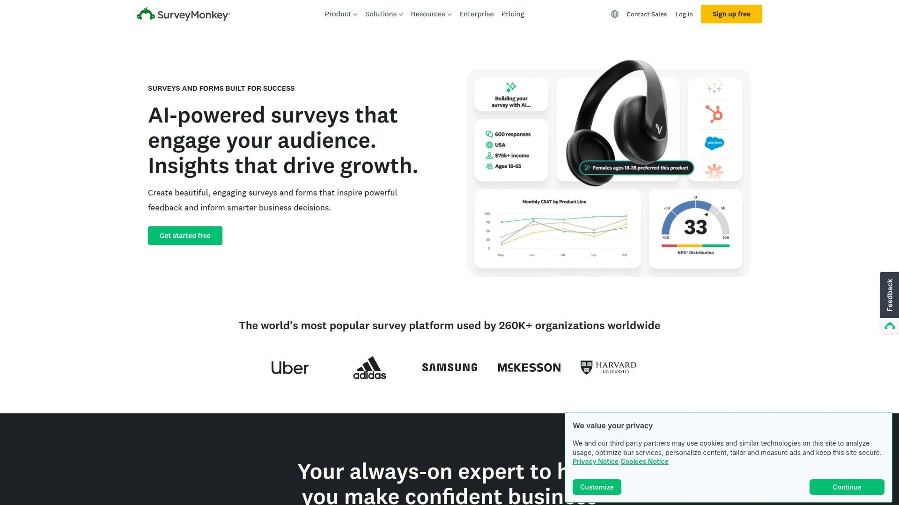

# 2025's Top 8 Best Customer Feedback Software

Building products customers actually want requires knowing what they think, but traditional feedback collection through email surveys gets 2-5% response rates, focus groups cost thousands per session, and manually analyzing scattered comments across support tickets, social media, and reviews consumes weeks without revealing actionable patterns. Modern customer feedback software automates the entire cycle—distributing surveys across multiple channels, collecting responses in real-time, and using AI to analyze sentiment and extract themes within minutes rather than months.

The best feedback management platforms combine omnichannel survey distribution reaching customers wherever they are, AI-powered analytics transforming unstructured comments into categorized insights, and automated workflows triggering actions when feedback reveals urgent issues—turning customer voices into continuous product improvements and service enhancements.

***

## **[Zonka Feedback](https://www.zonkafeedback.com)**

AI-driven feedback intelligence platform transforming CX management through automation.

Zonka Feedback delivers comprehensive customer experience management by combining AI-driven analytics with automation across three core pillars—smarter survey creation, multichannel feedback collection, and powerful intelligence engines. The platform simplifies building surveys through over 30 question types with skip logic, multilingual support providing automatic translation and localization, white-labeling for seamless brand experiences, and pre-fill technology auto-populating data fields to boost completion rates through personalization.

**Multichannel feedback collection captures customer voices across every touchpoint.** Surveys embed directly on websites or within products, distribute via email and SMS, connect through WhatsApp interactions, accommodate offline responses during in-person interactions, deploy through digital feedback buttons for instant reactions, and use microsurveys for quick pulse checks. This omnichannel approach ensures feedback gets captured wherever customers interact with your brand rather than forcing them into single-channel constraints they ignore.

The analytics engine leverages advanced AI tools analyzing customer input automatically. Sentiment analysis understands emotions behind responses rather than just counting words. Theme and entity detection identifies trending topics and frequently mentioned concepts without manual categorization. Intent-based routing directs feedback to appropriate teams based on what customers actually need. Automated tagging and categorization organize massive response volumes into digestible insights accessible to non-technical stakeholders.

Real-time dashboards display feedback metrics as they arrive, enabling immediate responses to emerging issues before they escalate. The closed-loop feedback system triggers follow-up actions automatically—routing negative feedback to support teams, alerting product managers about feature requests, and notifying executives when satisfaction scores drop below thresholds. This automation eliminates the lag between feedback collection and actionable response that plagues traditional survey tools.

Integration capabilities connect Zonka with existing business systems—CRMs, help desks, marketing automation platforms, and analytics tools—ensuring feedback data flows into operational workflows rather than sitting in isolated survey databases. The platform scales from small businesses running basic satisfaction surveys to enterprises managing complex customer journey mapping across global operations. Users praise the intuitive interface requiring minimal training, responsive customer support resolving setup questions quickly, and flexible pricing accommodating different budget levels without forcing unnecessary feature purchases.

---

## **[SurveyMonkey](https://www.surveymonkey.com)**

Industry-leading survey platform with 30+ million questions answered daily.

SurveyMonkey dominates the survey software market through ease of use, extensive template libraries, and pricing accessibility making professional feedback collection available to organizations of any size. Users launch surveys twice as fast compared to complex competitors like Qualtrics, going from question to insight at record speed through intuitive platforms and AI-powered suggestions optimizing survey design automatically.

The drag-and-drop survey builder requires no technical knowledge—select question types from extensive libraries, customize branding with logos and colors, add skip logic directing respondents through personalized paths, and deploy surveys within minutes. Pre-built templates cover every common use case from employee engagement and customer satisfaction to market research and event feedback, eliminating the blank-page paralysis that delays custom survey creation.

Distribution flexibility sends surveys via email, embeds them on websites, shares through social media, displays as website pop-ups, or distributes through SMS. The multichannel approach meets customers where they naturally engage rather than forcing them onto unfamiliar platforms. Mobile optimization ensures surveys display properly on smartphones and tablets—critical since over 60% of survey responses now come from mobile devices.

**Analytics and reporting transform raw responses into actionable insights.** Real-time results dashboards update as responses arrive, showing completion rates, average response times, and preliminary findings without waiting for survey closure. Filter and cross-tabulate data by demographics, response patterns, or custom segments identifying which customer groups feel what ways. Export capabilities send data to Excel, Google Sheets, or analytics platforms for deeper statistical analysis.

Integration with Mailchimp, Salesforce, Google Sheets, Microsoft Teams, and 100+ business tools embeds survey data into existing workflows. Marketing teams sync email lists and track campaign effectiveness. Sales teams identify dissatisfied customers requiring intervention. Product managers aggregate feature requests prioritizing roadmap decisions based on customer demand rather than internal assumptions.

Pricing starts with free plans accommodating basic surveys up to 10 questions and 40 responses monthly—sufficient for small businesses testing feedback collection before committing budgets. Paid plans from $25 monthly unlock unlimited questions, advanced logic, custom branding, and deeper analytics. Enterprise tiers add dedicated support, advanced security, and API access for custom integrations. The tiered approach creates entry points at multiple investment levels rather than forcing expensive commitments upfront.

---

## **[Qualtrics](https://www.qualtrics.com)**

Enterprise experience management platform with AI-powered predictive analytics.

Qualtrics represents the premium tier of experience management software, delivering unmatched sophistication for enterprises requiring advanced analytics, complex survey logic, and comprehensive customer journey mapping. The platform supports diverse experience management modules covering customer experience, employee experience, brand research, and product insights—creating unified intelligence across every stakeholder interaction rather than siloed survey tools addressing isolated needs.

Advanced survey design accommodates the most complex research requirements through extensive skip logic, branching, display logic, embedded data, and scoring capabilities. Whether running Net Promoter Score surveys or 200-question academic studies, Qualtrics supports nuanced flows and conditional paths with precision impossible in simpler tools. The survey builder scales from quick pulse checks to sophisticated longitudinal research tracking sentiment changes over months or years.

**Deep analytics and dashboards transform feedback into strategic intelligence.** Stats iQ performs statistical analysis identifying significant relationships between variables. Text iQ analyzes open-ended responses extracting sentiment, themes, and key phrases from thousands of comments automatically. Predict iQ uses machine learning anticipating future outcomes based on historical patterns—predicting churn risk, identifying at-risk customers, and forecasting satisfaction trends before they manifest.

Multichannel distribution deploys surveys via email, SMS, website intercepts, mobile apps, kiosks, and QR codes, capturing feedback at every customer touchpoint. The omnichannel approach builds comprehensive experience profiles rather than snapshot impressions from single interactions. Panel management capabilities provide access to research participants or tools building proprietary panels for longitudinal studies requiring consistent respondent pools.

The integration ecosystem connects with Salesforce, Marketo, SAP, Tableau, Slack, and hundreds of enterprise systems, tying feedback into operational processes and triggering automated workflows based on real-time data. Customer support teams receive alerts when satisfaction drops below thresholds. Marketing teams adjust campaigns based on sentiment analysis. Product teams prioritize features based on aggregated customer requests across all feedback channels.

Global capabilities support over 75 languages including complex character sets and right-to-left scripts, making Qualtrics suitable for multinational organizations collecting feedback across diverse markets. The enterprise focus shows in pricing—expect significant investments starting around $1,500 annually for basic plans, scaling to tens of thousands for comprehensive enterprise deployments. This premium positioning serves Fortune 500 companies and large research institutions prioritizing sophistication over affordability.

***

## **[Typeform](https://www.typeform.com)**

Conversational survey platform boosting completion rates through interactive design.

Typeform revolutionized survey design by presenting one question at a time in visually appealing, conversational flows that feel more like interactive conversations than traditional forms. This approach dramatically improves completion rates—87% of users report higher response rates compared to previous platforms by reducing cognitive load and maintaining engagement throughout the entire survey experience.

The one-question-at-a-time presentation focuses respondent attention completely on the current query without overwhelming them with long pages of questions. This sequential approach creates natural momentum carrying respondents through to completion rather than abandoning halfway when confronted with intimidating multi-question layouts. The clean, minimalist design emphasizes content over distracting interface elements, creating professional impressions reflecting well on brand perception.

**Visual customization maintains brand consistency across every survey element.** Upload logos, select brand colors, choose custom fonts, add background images or videos, and control layout spacing creating surveys visually indistinguishable from your main website or marketing materials. This consistency reinforces brand identity while maintaining professional polish that generic survey tools can't match.

Logic jumps and conditional branching personalize survey paths based on previous answers, showing only relevant questions rather than forcing respondents through irrelevant sections. Product feedback surveys skip feature questions about products respondents don't use. Customer satisfaction surveys adjust follow-up questions based on initial ratings. This dynamic personalization creates efficient, respectful experiences valuing respondent time.

Integration with 300+ business applications including Slack, Google Sheets, Mailchimp, Salesforce, and Zapier embeds Typeform into existing workflows. Responses automatically populate CRM systems, trigger marketing automation sequences, update project management tools, or flow into analytics dashboards without manual data transfers. The extensive integration ecosystem eliminates the disconnected survey silos plaguing organizations using standalone survey tools.

Pricing starts with free plans accommodating 10 responses monthly—sufficient for testing the platform before committing. Paid plans from $25 monthly unlock unlimited responses, advanced logic, custom branding, and removal of Typeform branding. The investment proves worthwhile for customer-facing surveys where visual appeal directly impacts response rates and brand perception.

---

## **[SurveySparrow](https://surveysparrow.com)**

Conversational surveys with built-in business intelligence and case management.

SurveySparrow pioneered chat-like survey interfaces making surveys feel more like friendly conversations than formal questionnaires. The conversational approach combined with robust business intelligence systems and case management tools creates comprehensive experience management platforms rather than basic survey collectors. Users track KPIs and metrics related to core goals and campaigns through built-in analytics without exporting data to separate BI tools.

The survey builder emphasizes conversational flow through chat-style interfaces that mimic messaging apps respondents use daily. This familiarity reduces friction and increases completion rates compared to traditional form layouts feeling clinical and impersonal. Questions appear sequentially with smooth animations creating engaging experiences keeping respondents interested through to completion.

**Omnichannel distribution automates customer interactions across multiple channels.** Deploy surveys via email, SMS, WhatsApp, website embeds, mobile apps, QR codes, and offline kiosks, ensuring feedback collection happens wherever customers naturally interact with your brand. The unified platform aggregates responses regardless of source, providing comprehensive views rather than fragmented channel-specific insights.

AI-powered insights analyze responses automatically, identifying trends, sentiment patterns, and key themes without manual coding or categorization. The system highlights urgent issues requiring immediate attention, tracks satisfaction metrics over time, and segments feedback by customer demographics or behavior patterns. These automated analytics democratize insights making sophisticated analysis accessible to non-technical stakeholders.

Reputation management tools within SurveySparrow help businesses monitor and respond to online reviews, track brand mentions across social platforms, and manage public perception proactively. Service ticket routing directs customer issues to appropriate support teams based on feedback content, closing the loop between feedback collection and issue resolution. This integrated approach treats surveys as starting points for customer relationships rather than isolated data collection exercises.

Pricing remains competitive with comprehensive features available at accessible price points starting around $19 monthly. The value proposition balances affordability with sophisticated capabilities, making SurveySparrow attractive for mid-market companies wanting enterprise-grade tools without enterprise budgets. Users consistently praise intuitive interfaces, responsive customer support, and flexible deployment options accommodating diverse organizational needs.

***

## **[Medallia](https://www.medallia.com)**

Enterprise experience management with predictive analytics and 200+ integrations.

Medallia serves large enterprises requiring comprehensive experience management across customer, employee, and brand touchpoints simultaneously. The platform captures feedback through surveys, online reviews, social media monitoring, call center interactions, chat logs, and in-person feedback mechanisms, aggregating diverse data sources into unified customer intelligence rather than fragmented channel-specific insights.

Predictive analytics powered by machine learning identify at-risk customers before they churn, forecast future satisfaction trends based on current patterns, and recommend proactive interventions preventing issues from escalating. This forward-looking intelligence transforms reactive feedback responses into proactive experience management addressing problems before customers complain publicly or defect to competitors.

**Text and sentiment analysis leveraging natural language processing automatically categorizes and interprets customer feedback.** The system identifies key themes, sentiment trends, and specific satisfaction or dissatisfaction drivers without manual coding. Understanding underlying sentiment behind feedback allows businesses addressing root causes rather than symptoms, enhancing overall satisfaction and loyalty through targeted improvements.

Role-based dashboards tailor insights by department or team, ensuring each stakeholder sees metrics relevant to their responsibilities without overwhelming irrelevant data. Marketing teams view campaign effectiveness metrics. Support teams monitor satisfaction trends by agent or channel. Product teams track feature request volumes and usage sentiment. This departmental customization increases adoption by making feedback actionable for every role.

Integration with 200+ business systems including Salesforce, Oracle, SAP, Microsoft Dynamics, Workday, and major CRM, ERP, and marketing platforms embeds Medallia into core operational workflows. Feedback data triggers automated actions across systems—updating customer records, creating support tickets, adjusting product roadmaps, or modifying marketing campaigns based on real-time sentiment shifts.

The enterprise focus translates to enterprise pricing—expect six-figure annual investments for comprehensive deployments. This premium positioning serves Fortune 500 companies and large multinational corporations prioritizing sophisticated analytics and proven scalability over cost minimization. Users report learning curves requiring training to leverage advanced capabilities fully, but the investment pays dividends through comprehensive experience intelligence impossible with simpler tools.

---

## **[Zendesk](https://www.zendesk.com)**

Customer service platform integrating feedback into support workflows seamlessly.

Zendesk makes the customer feedback software list by seamlessly integrating feedback collection into support workflows, allowing teams to immediately act on customer sentiment through built-in ticketing logic. This integration creates closed-loop systems where feedback doesn't sit in isolated databases but triggers immediate support actions addressing issues customers raise.

The platform combines customer feedback and survey features with comprehensive support ticketing, live chat, knowledge bases, and community forums. This all-in-one approach eliminates the disconnects plaguing organizations using separate survey tools and support systems requiring manual data transfers between platforms. Support agents view customer satisfaction scores and feedback directly within ticket interfaces, informing response strategies with full context.

**Detailed analytics track customer satisfaction metrics over time**, identifying trends by agent, channel, issue type, or customer segment. The analytics reveal which interactions satisfy customers and which create frustration, enabling targeted training, process improvements, or escalation procedures addressing systemic problems rather than treating individual complaints reactively.

Automated workflows route feedback to appropriate teams based on content, sentiment, or urgency scores. Negative feedback triggers immediate manager notifications. Feature requests automatically create product team tickets. Praise gets shared with relevant agents reinforcing positive behaviors. This automation ensures feedback drives action rather than languishing in analytics dashboards nobody monitors.

Pricing starts at $19 per user monthly when billed annually, positioning Zendesk as accessible to small and medium businesses while scaling to enterprise deployments supporting thousands of agents. The value proposition centers on unified customer service and feedback management rather than standalone survey capabilities, making Zendesk ideal for organizations prioritizing support workflows over pure research applications.

---

## **[Qualaroo](https://qualaroo.com)**

On-site nudge surveys capturing user feedback without interrupting experiences.

Qualaroo specializes in unobtrusive microsurveys appearing contextually within websites and applications, capturing user feedback at precise moments when experiences are fresh rather than relying on follow-up emails respondents ignore. The "nudge" approach displays small, targeted questions in corners of screens without interrupting user flows, dramatically increasing response rates compared to full-page survey interruptions that frustrate visitors.

Contextual targeting displays surveys based on specific user behaviors, page visits, time spent, exit intent, or custom triggers matching your research goals. Ask cart abandonment questions only to users leaving checkout pages. Survey feature satisfaction only for users who've actually used specific features. This precision targeting ensures questions reach relevant respondents rather than annoying everyone with irrelevant surveys.

The platform excels at capturing in-the-moment feedback when user experiences and emotions are freshest. Traditional email surveys sent days later rely on fading memories producing generic, less actionable responses. Qualaroo's real-time approach captures authentic reactions while users still feel the impacts of good or bad experiences.

Advanced analytics including sentiment analysis, word clouds, and response filtering transform open-ended feedback into structured insights. The system identifies common themes, tracks sentiment trends over time, and segments responses by user characteristics or behaviors. This automated analysis makes qualitative feedback as measurable as quantitative metrics.

Integration with Google Analytics, Salesforce, HubSpot, Slack, and major business tools ensures feedback data flows into existing analytics and operational systems. Marketing teams correlate survey responses with conversion rates. Product teams prioritize features based on aggregated requests. Support teams proactively address issues users report through surveys before formal complaints arrive.

***

## FAQ

**What's the actual difference between customer feedback software and regular survey tools?**

Customer feedback software provides comprehensive experience management including multichannel distribution, AI-powered analytics, automated workflows, and closed-loop systems triggering actions based on responses. Regular survey tools focus narrowly on questionnaire creation and basic reporting without automation or intelligence layers. Feedback platforms like Zonka Feedback and Medallia analyze sentiment, route issues to appropriate teams, and integrate with business systems creating actionable intelligence. Basic survey tools like Google Forms simply collect responses without transformation into operational insights. Choose feedback software when you need continuous experience monitoring with automated responses; choose survey tools for occasional research projects not requiring sophisticated analysis.

**How quickly can you actually set up and launch your first customer feedback survey?**

Modern platforms like Zonka Feedback, SurveyMonkey, and Typeform enable survey launches within 15-30 minutes using pre-built templates, drag-and-drop builders, and instant distribution. Select industry-specific templates matching your use case, customize questions and branding, configure distribution channels, and activate surveys immediately without technical setup or IT involvement. More sophisticated enterprise platforms like Qualtrics and Medallia require longer implementations—days or weeks—when configrating complex integrations, custom dashboards, and automated workflows. For quick pulse checks and basic satisfaction surveys, expect same-day launches; for comprehensive experience management programs, plan 2-4 week implementation timelines.

**Do AI-powered feedback analytics actually work or is it just marketing hype?**

AI analytics in leading platforms like Zonka Feedback, Qualtrics, and Medallia demonstrably transform unstructured feedback into actionable insights within minutes rather than the days or weeks manual analysis requires. Sentiment analysis accurately classifies feedback as positive, negative, or neutral with 85-95% accuracy rivaling human coders. Theme detection identifies trending topics and common phrases across thousands of responses automatically. Intent recognition routes feedback to appropriate teams based on what customers actually need. These capabilities eliminate the manual categorization bottleneck preventing many organizations from analyzing open-ended feedback at scale. However, AI quality varies dramatically—premium platforms deliver reliable results while budget tools often produce unreliable categorization requiring extensive manual correction.

***

## Conclusion

Customer feedback software transforms scattered customer voices into coordinated intelligence driving product improvements, service enhancements, and experience optimization across every touchpoint. These eight platforms eliminate the manual drudgery of survey distribution, response collection, and insight extraction, delivering automated systems that continuously monitor customer sentiment and trigger appropriate actions without constant human oversight. [Zonka Feedback](https://www.zonkafeedback.com) particularly excels for businesses wanting comprehensive AI-driven feedback intelligence—combining smart survey creation, omnichannel distribution, powerful analytics engines, and automated workflows within accessible platforms requiring minimal training while delivering sophisticated insights rivaling enterprise tools costing significantly more.
